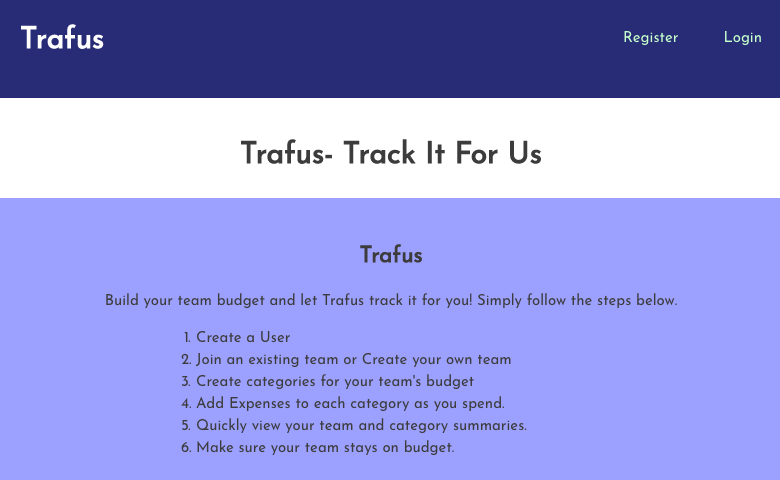
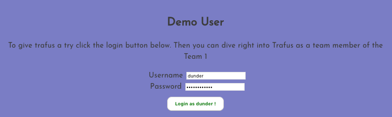
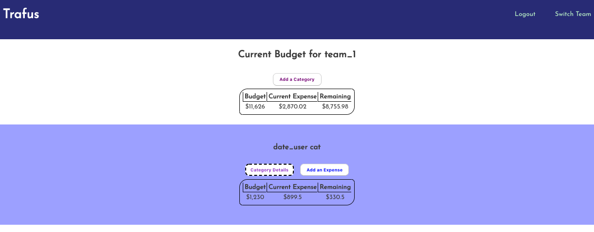
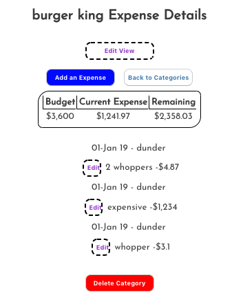
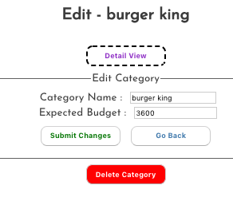
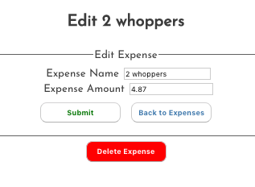

# Trafus

## Summary
Trafus is a team budgeting app. Allows multiple users to maintain team budgets together!

For more details on how to use the application please visit [client repository](https://github.com/rtanubra/Trafus)

## Steps for setup

### `Database`

#### `Create a postgres database`
create a postgres database and create .env file using example:

example.env.txt

#### `Migrate database`
`npm run migrate` to migrate database

`npm run migrate-production` to migrate production database. 

This requires you to create a production database and point to it.

#### `Optional seed database`
seeds are located in ./seeds

## Links
Trafus Application :[ https://rtanubra-trafus-app.now.sh/ ](https://rtanubra-trafus-app.now.sh/)

Client repository : [ https://github.com/rtanubra/Trafus ](https://github.com/rtanubra/Trafus)

Server repository: [ https://github.com/rtanubra/Trafus-Server ](https://github.com/rtanubra/Trafus-Server)

## Available Scripts
### `npm run dev`
Runs the app in the development mode. 
### `npm start`
Starts the application 
### `npm run migrate`
migrates development database 
### `npm run migrate-production`
migrates production database 
### `npm test`
Launches the test runner in the interactive watch mode. 
### `npm run deploy`
Builds and deploys your application to production 

## API Documentation
The application has four main parts:

Development Server located at: [http://localhost:8000/api/](http://localhost:8000/api/)

Production Server located at: [https://tranquil-journey-83977.herokuapp.com/api/](https://tranquil-journey-83977.herokuapp.com/api/)

All return objects (if present) will be in JSON format.

<ol>
    <li>Authentication</li>
    <li>Teams</li>
    <li>Users</li>
    <li>Categories</li>
    <li>Expenses</li>
</ol>

### `Authentication`

#### `POST: /login`

Posts a user authentication for login.

Body should include:
<ul>
    <li>user_name (bit 64 encoded username) - required</li>
    <li>password (bit 64 encoded password) - required</li>
</ul>

Success will return:
<ul>
    <li>JWT TOKEN: payload includes: 
        <ol>
            <li>user_id - id of of user logged in </li>
            <li>team_id - team id that the user belongs to at this time.</li>
        </ol>
    </li>
</ul>

### `Teams`

#### `GET: /teams`:
Gets all teams in trafus_teams
####  `POST /teams`:
Posts a team to trafus_teams

body should include:
<ul>
    <li>name (team name) required</li>
    <li>password (team password) optional</li>
</ul>

####   `GET: /teams/:teamId`:
Gets a single team by ID in trafus_teams

### `Users`

#### `GET: /users`:
Gets all users in trafus_users
#### `PATCH: /users`:
Updates a single user in trafus_users
Use this when a user switches teams, to maintain different budgets.

body should include:
<ul>
    <li>id (user id to update) required</li>
    <li>team_id (team id to join) required</li>
    <li>password (team password) required if joining a private team</li>
</ul>

#### `POST: /users`:
Posts a new user into trafus_users

#### `GET: /users/:userId`:
Gets a single user in trafus_users

### `Categories`

#### `GET: /categories/:teamId`

Gets obtain all the categories belonging to a specific team from trafus_categories.

body should include:

<ul>
    <li>team_id -required</li>
</ul>

#### `POST: /categories/:teamId`

Posts a new category with a specified team_id into trafus_categories

body should include:

<ul>
    <li>team_id (team id where category will belong to) - required</li>
    <li>name (category name) - required</li>
    <li>budget (budget for the new category) - required</li>
</ul>

#### `GET /category/:categoryId`

Gets a single category from trafus_categories with a specified id. 

#### `PATCH /category/:categoryId`

Updates a category with categoryId from trafus_categories

body should include:

<ul>
    <li>categoryId (id to of category to be updated) required</li>
    <li>name (new category name) - name or budget required</li>
    <li>budget (new budget for category) - name or budget required</li>
</ul>

#### `DELETE /category/:categoryId`

Deletes a category from trafus_categories by id.

### `Expenses`

#### `GET /expenses`

GETs all the expenses from trafus_expenses

#### `POST /expenses`

POSTS a new expense into trafus_expenses

body should include:

<ul>
    <li>name (expense name) required</li>
    <li>expense (expense amount) required</li>
    <li>category_id (which category expense belongs to) required</li>
    <li>creator_id (which user created this expense) required</li>
    <li>date_created (date this expense was created) optional - defaults to today</li>
</ul>

#### `GET /expenses/:expenseId`

gets a single expense from trafus_expenses by id

#### `PATCH /expenses/:expenseId`

Updates an expense from trafus_expenses by id

body should include:

<ul>
    <li>name (new expense name) - 1 of name/expense required</li>
    <li>expense (new expense amount) - 1 of name/expense required</li>
</ul>

#### `DELETE /expenses/:expenseId`

deletes a single expense from trafus_expenses by id

## Screenshots

### `Landing Page -with instructions`

### `Quick Login to use demo account`

### `Team summary`

### `Category Summary`

###  `Edit Category`

### `Edit Expense` 

## Technology Used
### `Client`
<ul>
    <li>HTML</li>
    <li>CSS</li>
    <li>Javascript</li>
    <li>React</li>
</ul>

### `Server`
<ul>
    <li>NodeJS</li>
</ul>

### `Database`
<ul>
    <li>PostgreSQL</li>
</ul>